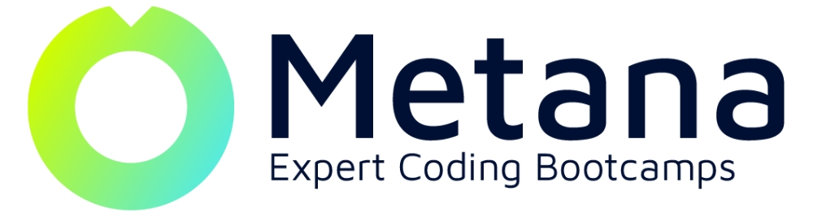

# Metana Web3 Interview Questions

Welcome to the **Metana Web3 Interview Questions** repository! This resource is designed to help Metana students prepare for interviews in various Web3 roles.

## Purpose

This repository serves as a collaborative platform for Metana students to:

1. **Share real interview questions** they've encountered
2. **Provide and discuss answers** to these questions
3. **Prepare for upcoming interviews** in the Web3 space

## Available Questions

### General Interview Questions

- [Personal Background](/general-interview-questions/1.personal-background/README.md)
- [Experience and Background](/general-interview-questions/2.experience-and-background/README.md)
- [Role and Company Specific](/general-interview-questions/3.role-and-company-specific/README.md)
- [Questions for the Employer](/general-interview-questions/4.questions-for-the-employer/README.md)

### Blockchain and Solidity Interview Questions

- [Blockchain](/blockchain-and-solidity-interview-questions/blockchain/README.md)
- [Solidity](/blockchain-and-solidity-interview-questions/solidity/README.md)

### Role Based Interview Questions

- **Frontend Developer**

  - [Web3 Fundamentals](/role-based-interview-questions/frontend-developer/1.web3-fundamentals/README.md)
  - [Technical Experience](/role-based-interview-questions/frontend-developer/2.technical-experience/README.md)
  - [Technologies and Tools](/role-based-interview-questions/frontend-developer/3.technologies-and-tools/README.md)
  - [Collaboration and Project Management](/role-based-interview-questions/frontend-developer/4.collaborations-and-project-management/README.md)

- **Smart Contract Developer**

  - [Basic Concepts](/role-based-interview-questions/smart-contract-developer/1.basic-concepts/README.md)
  - [Cryptography](/role-based-interview-questions/smart-contract-developer/2.cryptography/README.md)
  - [Security and Attacks](/role-based-interview-questions/smart-contract-developer/3.security-and-attacks/README.md)
  - [Ethereum Specific Questions](/role-based-interview-questions/smart-contract-developer/4.ethereum-specific-questions/README.md)

## How to Use

1. **Navigate** to the directory that matches the role you're interested in.
2. **Review** the questions and answers in the README file.
3. **Contribute** your insights or alternative answers if you have them!

## Contributing

We encourage all Metana students to **contribute** to this repository. Your experiences and knowledge are valuable to the community!

To contribute:

1. **Fork** this repository
2. **Create** a new branch for your changes
3. **Add** your questions and answers
4. **Submit** a pull request

For detailed instructions on how to contribute, please read our [CONTRIBUTING.md](./CONTRIBUTING.md) file.

## Review Process

All contributions will be **reviewed** by fellow Metana students and instructors to ensure accuracy and relevance.

## Disclaimer

While we strive for accuracy, please note that the answers provided here are contributed by students and may not always represent the only correct answer. Use this as a study aid, but also consult other resources and keep learning!

## Future Plans

We plan to **expand and improve** this repository over time. Future updates may include:

- Additional roles and specializations
- Tagging system for difficulty levels and specific technologies
- Enhanced search and navigation features

Stay tuned for updates!

## Contact

Metana can be contacted through the following means: **Call us directly:** (415) 416-0800 or **Email us:** info@metana.io.

---

This repository is initially provided to Metana students who are participating in the [Web3 Solidity Bootcamp](https://metana.io/web3-solidity-bootcamp-ethereum-blockchain/) and moving into Metana's [Jobcamp](https://metana.io/jobcamp/) to support ongoing job placement and career development.
